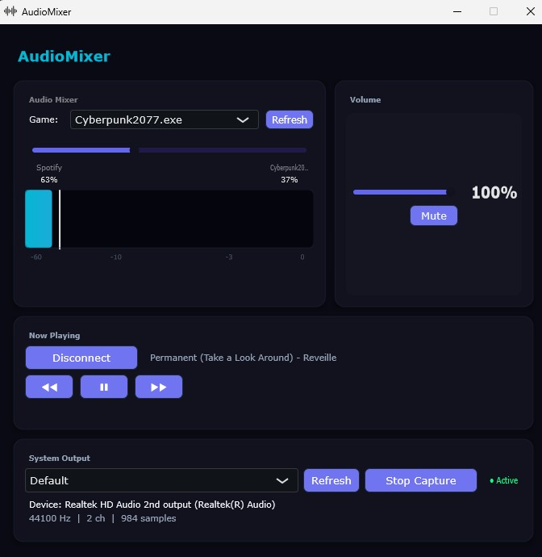

# AudioMixer: Adaptive Game Music System

A Windows desktop app that dynamically blends your Spotify music with game audio, giving the impression your playlist is part of the game.

## Motivation

Many video games have soundtracks I don't enjoy or want to hear. I love hard rock and obv most games don't feature hard rock, and even if they do, some of them are just bad lmao. I'd rather have my own Spotify playlist playing in the background. But manually balancing game and Spotify volume requires alt-tabbing, exiting, and that's just annoying imo.

So I built this app to address that. It analyzes game audio in real time and automatically ducks (lowers) Spotify volume during loud moments, then brings it back during quiet moments. The result: your music feels like it belongs in the game.

Inspired by Xbox's Spotify "game vs music" volume slider, a feature Windows is missing.

## Screenshot



## Features

- **Per-app volume control** — Independent volume adjustment for any running executable via Windows Audio Session API, balanced through a crossfader interface
- **Spotify integration** — OAuth PKCE authentication with auto-refreshing tokens, playback control (play/pause/skip), and bidirectional volume sync
- **Global hotkeys** — 8 system-wide shortcuts using a low-level keyboard hook (`WH_KEYBOARD_LL`) that work across fullscreen games — balance, mute, play/pause, skip, and overlay toggle without leaving your game
- **Overlay HUD** — Always-on-top transparent window showing current track, artist, and crossfader balance — click-through design doesn't steal focus from fullscreen applications
- **Real-time audio metering** — WASAPI shared-mode loopback capture with RMS computation and dB-scaled level visualization
- **System tray** — Minimizes to tray with right-click menu (Show, Mute, Quit)
- **Per-device capture** — Select any active audio output device from a dropdown, refreshable for hot-plugged hardware
- **Crash resilience** — Atomic JSON settings writes, automatic backup recovery from corrupted configs, type-validated deserialization

## Hotkeys

| Shortcut               | Action                 |
| ---------------------- | ---------------------- |
| `Ctrl` + `↑`           | Balance toward Spotify |
| `Ctrl` + `↓`           | Balance toward game    |
| `Ctrl` + `Shift` + `M` | Mute / Unmute          |
| `Ctrl` + `Shift` + `P` | Play / Pause           |
| `Ctrl` + `Shift` + `→` | Next track             |
| `Ctrl` + `Shift` + `←` | Previous track         |
| `Ctrl` + `Shift` + `H` | Toggle overlay HUD     |
| `Ctrl` + `Shift` + `O` | Show / Hide window     |

### Example


## Installation

Download the latest release from [Releases](../../releases), extract the `.zip`, and run `AudioMixer.exe`.

**System requirements:**

- Windows 10 or later
- Spotify account (free or premium)
- A default web browser (for OAuth login)

## Building from source

```bash
# Clone
git clone https://github.com/MM120-i/Adaptive-Game-Audio-Mixer.git
cd Adaptive-Game-Audio-Mixer

# Install JUCE submodule
git submodule update --init

# Set Spotify Client ID (register at developer.spotify.com)
echo "SPOTIFY_CLIENT_ID=your_client_id_here" > .env

# Build + test (Debug)
.\build.bat test

# Create release package
.\build.bat release
```

**Build requirements:**

- Visual Studio 2026 with C++20 toolchain
- CMake 3.22+
- Windows 10 SDK

## Tech Stack

| Layer     | Technology                                                      |
| --------- | --------------------------------------------------------------- |
| Language  | C++20                                                           |
| Framework | JUCE 8 (UI, events)                                             |
| Audio     | WASAPI loopback, `IAudioSessionManager2` COM interop            |
| Auth      | Spotify Web API (OAuth PKCE)                                    |
| Windowing | Win32 (`WS_EX_LAYERED`, `SetWindowsHookEx`, `Shell_NotifyIcon`) |
| Build     | CMake + Visual Studio 2026                                      |
| CI        | GitHub Actions (MSVC `/analyze` + cppcheck)                     |
| Testing   | JUCE UnitTest framework — 60 tests across 8 suites              |

## Architecture

```text
src/
├── ui/          # JUCE Components (MainComponent, AudioBalancer, VolumeControl,
│                  LevelMeter, OverlayHud, VolumeNotification)
├── audio/       # WASAPI capture engine, per-app session manager
├── core/        # Settings store, Spotify client, global hotkeys, system tray, logger
└── Main.cpp     # Application entry point, hotkey wiring, tray setup
```

## License

MIT
